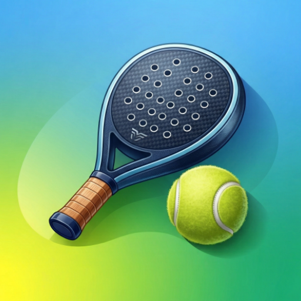

[](https://github.com/davidpastorvicente/padelMatch/actions/workflows/release-apk.yml)

# PadelMatch



An Android app for tracking padel match sessions with your regular group. Record sets, track player statistics, and visualise win-ratio trends over time.

## Features

- **Match history** — browse all past sessions with an inline calendar filter
- **Session detail** — see every set played, the bracket result, and the classification chart
- **Player statistics** — shows aggregate stats and time-proportional win-ratio trends per player
- **Combined win-ratio chart** — opens a full-screen comparison chart with point tooltips
- **Player detail** — displays individual charts and clickable session history
- **Import / Export** — supports JSON backup and restore from the overflow menu

## Tech Stack

| Layer | Technology |
| --- | --- |
| Language | Kotlin 2.0 |
| UI | Jetpack Compose + Material 3 |
| Architecture | MVVM + Repository |
| DI | Hilt |
| Database | Room |
| Navigation | Compose Navigation |
| Async | Kotlin Coroutines + Flow |
| Serialization | kotlinx.serialization |

## Requirements

- Android **8.0+** (API 26)
- Target SDK **35**
- JDK **21** (JetBrains runtime)

## Project Structure

```text
app/src/main/java/com/davidpv/padelmatch/
├── data/
│   ├── db/          # Room database, DAOs, entities
│   ├── model/       # Domain models
│   ├── repository/  # Data access layer
│   ├── importer/    # JSON import logic
│   └── exporter/    # JSON export logic
├── di/              # Hilt modules
└── ui/
    ├── history/     # Match history screen + inline calendar
    ├── navigation/  # Bottom nav, app navigation graph
    ├── newmatch/    # New match creation wizard
    ├── results/     # Edit set results
    ├── session/     # Session detail screen
    ├── statistics/  # Player stats + player detail screens
    └── theme/       # Colours, typography, player colour palette
```

## Getting Started

Clone the repo and open it in Android Studio. See [`.github/copilot-instructions.md`](.github/copilot-instructions.md) for architecture details, build commands, and project conventions.

## Build

```bash
# Debug APK
./gradlew assembleDebug

# Install with ADB
adb install app/build/outputs/apk/debug/app-debug.apk
```

Debug output:

```text
app/build/outputs/apk/debug/app-debug.apk
```

## Usage

### Recording sessions

Create a new match day, choose the players, and save the session. Each session stores multiple sets and feeds the historical statistics views.

### Import / Export

Use the overflow menu to export your data as JSON or import a previous backup.

## CI

Every push to `master` triggers `.github/workflows/debug-apk.yml`, which builds and uploads a debug APK artifact retained for 7 days.

## Notes

- All user-facing text is in Spanish
- One session is stored per calendar day
- Charts use time-proportional positioning for player trend lines
